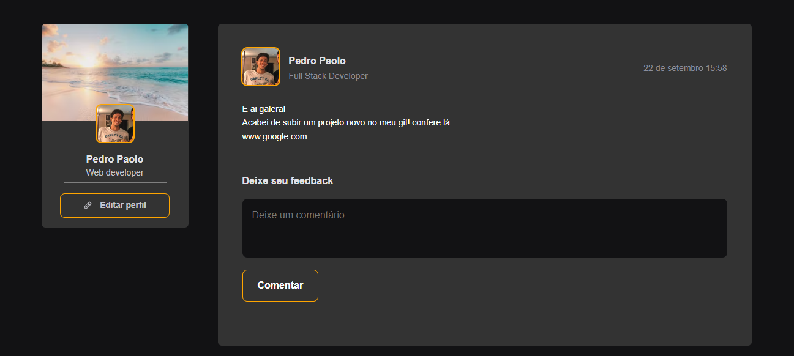
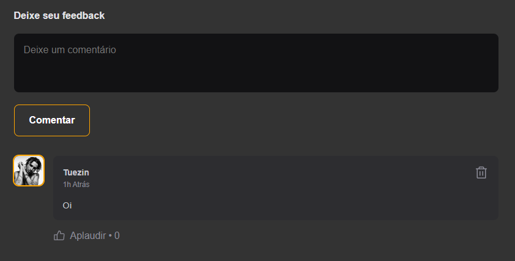

# socialMedia
## Resumo da aplicação

Dashboard inicial responsivo para uma rede social genérica. Contém uma seção de perfil fixa e outra que comporta os posts e seus respectivos cometários. Objetivando simular a utilização de dados resgatados de uma API, foi criada a variável de apoio denominada **posts**, que pode ser acessada no arquivo principal da aplicação **App.jsx**.



É possível adicionar novos posts através da variável **posts**, que segue o modelo:

```
{
    id: 1,
    author: {
      avatarUrl: 'https://github.com/pedropaolo.png',
      name: 'Pedro Paolo', 
      role: 'Full Stack Developer'
    },

    content: [
      { type: 'paragraph' , content: "E ai galera!"},
      { type: 'paragraph' , content: "Acabei de subir um projeto novo no meu git! confere lá"},
      { type: 'paragraph' , content:'www.google.com'}
    ],

    publishedAt: new Date('2022-09-22T15:58:00')
  } 
```

Inicialmente, os posts não possuem comentários. É possível adicionar comentários através da caixa de texto e botão que ficam na parte inferior de uma publicação. É possível também deletar comentários e reagir aos mesmos, através da função **aplaudir**.




## Estrutura base / Inicialização

A estrutura base do projeto foi criada com a utilização do Vite, ferramenta de construção de código que pode ser acessada em : https://vitejs.dev/guide/; Para iniciaizar a aplicação

```
npm install ou yarn
```

```
-- npm run dev --
```


